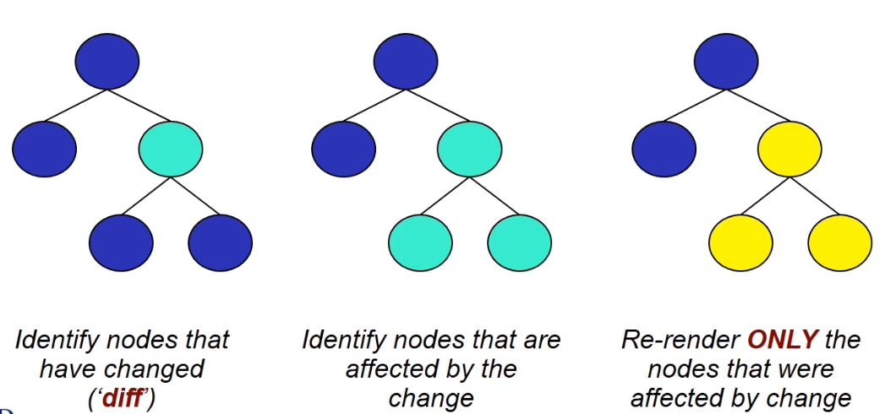

Normal DOM re-render all nodes with change

### Virtual DOM
diff -- determine which nodes withing DOM have changed
reconciliation -- to update the nodes thar are affected



### react 
1. allocate postition for rendered component (div)
2. create component in js (state, events, function)
3. drop component to allocated position

```js
<!DOCTYPE html>
<html>
    <head>
        <title>ReactJS Example</title>
        <script src="react.js"></script>
        <script src="react-dom.js"></script>
    </head>
    <body>
        <div id="container"></div>
        <script type="text/jsx">
            <!-- react code -->
        </script>
    </body>
</html>
```

### JSX - JS XML Syntax Transfrom
* allows user to write html-lite tags within JS
* converts text to react code

React.createClass() --> ReactDOM.render()

1. Propreties -- initialization
2. State -- lifetime

Lifecycle functions are invoked depending on relevant activities